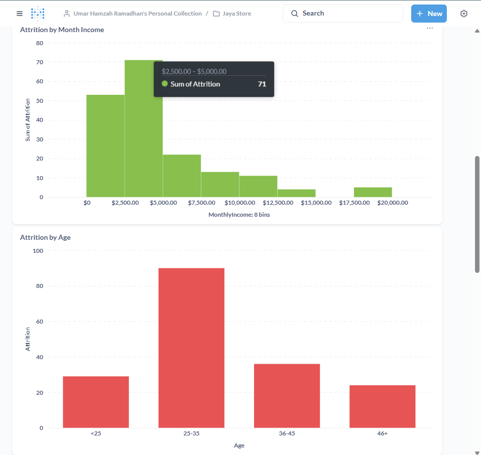

# **Proyek Akhir: Menyelesaikan Permasalahan Perusahaan Edutech**
## **Business Understanding**
Jaya Jaya Maju merupakan perusahaan multinasional yang bergerak di bidang Edutech (Teknologi Pendidikan) dan telah berdiri sejak tahun 2000. Perusahaan tersebut memiliki lebih dari 1000 karyawan yang tersebar di seluruh penjuru negeri. Meskipun menjadi perusahaan yang cukup besar, Jaya Jaya Maju menghadapi tantangan operasional yang signifikan, terutama dalam pengelolaan sumber daya manusia. Hal ini tercermin dari rasio jumlah karyawan yang keluar (attrition rate) yang melebihi 10% setiap tahunnya, sebuah angka yang mengindikasikan adanya permasalahan mendasar dalam retensi karyawan.

## **Permasalahan Bisnis**
Permasalahan yang dialami oleh perusahaan Jaya Jaya Maju yakni meliputi tingginya tingkat rasio *attrition rate* karyawan yang keluar setiap tahunnya yang mencapai lebih dari 10%. Angka ini tergolong tinggi jika dibandingkan dengan rata-rata attrition rate di industri teknologi yang menjadi tolok ukur. Tingginya tingkat attrition ini membawa dampak negatif yang signifikan bagi perusahaan, di antaranya:

1. Peningkatan Biaya Rekrutmen: Kebutuhan terus-menerus untuk merekrut pengganti meningkatkan biaya operasional.
2. Kehilangan Pengetahuan Institusional: Karyawan yang keluar membawa serta pengetahuan dan pengalaman berharga.
3. Penurunan Produktivitas: Waktu yang dibutuhkan untuk karyawan baru beradaptasi dan mencapai produktivitas penuh dapat mengganggu alur kerja tim. 

## **Cakupan Proyek**
Dalam upaya untuk mengatasi permasalahan, proyek ini dibuat untuk melakukan identifikasi terhadap faktor-faktor yang dapat mempengaruhi tingginya tingkat *attrition rate* tersebut. Analisis dilakukan dengan menggunakan parameter berikut:
1. Departemen dan posisi pekerjaan karyawan.
2. Tingkat penghasilan bulanan.
3. Usia karyawan.
4. Tingkat kepuasan kerja (Job Satisfaction).
5. Keseimbangan kehidupan kerja (Work Life Balance). 
Hasil analisis disajikan dalam bentuk visualisasi data pada sebuah dashboard untuk menunjukkan pengaruh setiap faktor terhadap keputusan karyawan untuk keluar. Selain itu, proyek ini juga menerapkan model machine learning untuk menganalisis dan mengidentifikasi Top-N faktor yang paling signifikan mempengaruhi attrition.

## **Persiapan**
Sumber data: [Jaya-jaya Maju](https://github.com/dicodingacademy/dicoding_dataset/tree/main/employee)

Setup environment:
- Menjalankan Python Notebook
1. Membuat environment python
    ```
        conda create --name jaya-maju python=3.9
    ```
2. Aktivasi environment
    ```
        conda activate jaya-maju
    ```
3. Instal package yang dibutuhkan
    ```
        pip install -r requirements.txt
    ```
- Menjalankan Dashboard Metabase
Pastikan Docker sudah terinstall di sistem
1. Pull Image Metabase
   ```
   docker pull metabase/metabase
   ```
2. Jalankan Container Metabase
   ```
   docker run -d -p 3000:3000 --name metabase metabase/metabase
   ```
3. Akses Metabase (Akses di [Metabase](http://localhost:3000))
4. Login Credential
5. Akses Dashboard
# **Business Dashboard**

Pada Gambar Dashboard 1, terdapat visualisasi mengenai perbandingan antara jumlah karyawan yang keluar (label 1) dan jumlah yang karyawan yang menetap (label 0). Kemudian dilanjutkan dengan perbandingan jumlah karyawan yang keluar pada masing-masing departemen, yang secara berurutan dari paling tinggi yakni departemen Research & Development dilanjutkan dengan Sales dan Human Resources. Kemudian pada Bar Chart pada jumlah karyawan yang keluar pada setiap posisi pekerjaan yang dimana paling tinggi pada posisi Laboratory Technician dan Research Scientis dari departemen R&D dilanjutkan dengan Sales Executive dan Sales Representative dari divisi Sales.


Pada Gambar Dashboard 2, terdapat visualisasi mengenai perbandingan antara jumlah karyawan yang keluar terhadap Gaji Bulanan yang didapatkan. Pada bar chart tersebut, karyawan dengan gaji kurang dari $5000 memiliki jumlah yang lebih tinggi, meski tidak dapat dipungkiri jika karyawan dengan gaji $20000 masih ada yang memutuskan untuk keluar. Aspek ini tidak dapat menjadi acuan utama sebagai alasan untuk seorang karyawan keluar. Selain itu juga masih ada banyak faktor pendukung terkait jumlah pendapatan yang diterima karyawan. Kemudian, terdapat bar chart rasio antara jumlah karyawan keluar terhadap usia karyawan. Berdasarkan bar chart tersebut mayoritas karyawan yang keluar berada di usia 25 hingga 35 tahun.


Pada Gambar tersebut, ditunjukkan jumlah attrition terhadap tingkat Job Satisfaction dan Work Life Balance dalam bentuk bar chart dan heatmap. Berdasarkan visualisasi tersebut tingkat attrition tertinggi terdapat pada tingkat Job Satisfaction High (3) dan Work Life Balance Excellent (3) dilanjutkan dengan Job Satisfaction Low (1) dan Work Life Balance Excellent (3). Hal tersebut tidak bisa dijadikan sebagai faktor utama sebagai penyebab dari seorang karyawan keluar karena mayoritas pada karyawan dengan tingkat Work Life Balance yang tinggi (Excellent).

## Credential Metabase
email: user1234@mail.com
password: User1234

# **Conclusion**
Berdasarkan analisis data dan pemodelan machine learning, kesimpulan berikut disusun untuk menjawab permasalahan tingginya attrition rate di Jaya Jaya Maju:

1. **Faktor Utama Penyebab Attrition dan Karakteristik Karyawan**:
   1. Departemen dan Peran: Visualisasi dashboard (Gambar 1) menunjukkan bahwa departemen Research & Development (R&D) dan Sales memiliki tingkat attrition tertinggi. Secara spesifik, peran pekerjaan seperti Laboratory Technician, Research Scientist, Sales Executive, dan Sales Representative adalah yang paling rentan.
   2. Demografi dan Kondisi Kerja: Karyawan yang cenderung keluar mayoritas berada di rentang usia produktif 25 hingga 35 tahun (Gambar 2). Model machine learning mengonfirmasi bahwa faktor-faktor seperti tingkat pekerjaan yang rendah (JobLevel), lembur (Overtime), frekuensi perjalanan bisnis, dan status pernikahan menjadi prediktor kuat attrition.
   3. Gaji dan Kepuasan Kerja: Meskipun karyawan dengan gaji di bawah $5000 menunjukkan jumlah attrition yang tinggi (Gambar 2), ini bukan satu-satunya faktor penentu. Menariknya, attrition tetap terjadi pada karyawan dengan tingkat kepuasan kerja (Job Satisfaction) dan keseimbangan hidup (Work Life Balance) yang tinggi (Gambar 3). Hal ini mengindikasikan adanya masalah lain yang lebih mendesak yang tidak terukur dari metrik Job Satisfaction saja.
2. **Pemanfaatan Model Prediktif**:
   Model machine learning (Logistic Regression) yang dikembangkan dapat digunakan secara proaktif oleh departemen HR. Dengan menganalisis kombinasi faktor-faktor Top-N seperti JobLevel, JobRole, Overtime, dan YearsAtCompany, model ini dapat mengidentifikasi karyawan aktif yang memiliki probabilitas tinggi untuk keluar. Ini memungkinkan HR untuk melakukan intervensi yang ditargetkan sebelum karyawan memutuskan untuk resign.
3. **Visualisasi Dashboard sebagai Alat Monitoring**:
   Dashboard yang telah dibuat menyajikan visualisasi yang ringkas dan mudah dipahami mengenai area-area kritis. Manajemen dan HR dapat dengan cepat melihat departemen, peran, dan demografi mana yang paling terdampak, sehingga dapat memfokuskan sumber daya pada area yang paling membutuhkan perhatian untuk menekan angka attrition rate.

# **Rekomendasi Action Items**
Dalam menyelesaikan permasalahan terdapat beberapa upaya, yakni:
1. Melakukan analisis mendalam pada aspek-aspek pendukung di balik tingginya attrition di departemen R&D dan Sales. Fokus pada faktor-faktor seperti beban kerja, budaya tim, peluang pengembangan karir, dan hubungan dengan manajer.
2. Menggunakan hasil analisis untuk mengidentifikasi akar permasalahan spesifik yang terjadi pada masing-masing divisi dan peran pekerjaan yang paling terdampak.
3. Memanfaatkan model prediktif untuk membuat daftar pantauan (watchlist) karyawan yang berisiko tinggi dan merancang program retensi yang dipersonalisasi, seperti penyesuaian beban kerja, peluang promosi, atau program mentoring.

